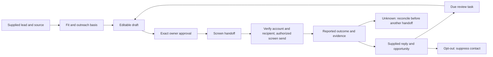

# LinkedIn sales and marketing process

Mithril's LinkedIn workflow starts with supplied qualified leads, drafts a useful
personal introduction, requires exact owner review, hands the editable draft to
the owning host's screen operator, records its observed send outcome and tracks supplied replies and
opportunities. This is a shipped local CRM workflow. It is separate from Admin
email campaigns: email consent, email bindings and campaign credit rewards never
grant LinkedIn messaging authority or permission to contact another member.

## Current runtime

[Skill](../skills/sales/mithril-linkedin-sales/SKILL.md) packages a standard-library
Python CLI and SQLite storage. Its [operation contract](../skills/sales/mithril-linkedin-sales/references/operations.md)
is executable offline. The Registry builder packages and hashes the runtime into
the generated installable Skill entry. The [integration contract](../integrations/linkedin-sales.json)
records component maturity without inventing hosted endpoints or executable
Agent/Plugin registrations. Each owner selects a private workspace and host
profile. No production D1 migration, user targeting or messaging is performed.

Lead records retain source, observation date, outreach basis and fit reason.
Do not treat a public profile as consent. Drafts are immutable, approvals bind
recipient/channel/content/owner, mutations are idempotent, state transitions
serialize, and opt-outs suppress all subsequent handoffs. Unknown outcomes block
another handoff. Receipt evidence is reported from the screen and stored alongside the
actual sent text; it is not provider acceptance or confirmed delivery.

Sales stages are qualified, replied, meeting, proposal, won and lost. Stage
changes require explicit evidence and revision. Review timing is operator-set;
there is no automatic cadence or outbound scheduler. Marketing covers campaign
planning and personalized LinkedIn drafts. Public posts, paid ads, lead forms,
Sales Navigator connectors and automated conversion attribution are outside this
version. Local counts measure local recorded activity only.

## Provider boundary and future connected runtime

Checked 2026-10-08: [Messages API](https://learn.microsoft.com/en-us/linkedin/shared/integrations/communications/messages)
is restricted to approved partners and requires a specific member action,
editable preview and affirmative send decision. [LinkedIn's automation policy](https://www.linkedin.com/help/linkedin/answer/a1340567/automated-activity-on-linkedin?lang=en)
disallows third-party automation of website activity. Therefore this runtime has
no network client, background browser bot, cookie access, scraped discovery, bulk sending,
or scheduled LinkedIn messages. No real outreach is authorized by registration.

A future approved provider adapter must bind the owning authenticated member,
partner scope, exact recipient/thread and payload digest to a fresh send action;
reject unsupported API permissions and incentivized messages; persist a dispatch
claim before network I/O; store accepted/rejected/unknown outcomes; reconcile
unknowns before retry; and isolate credentials/receipts per host account. Human
approval of a campaign is insufficient for the API's per-message member action.
Connection invitations and InMail require separate verified provider contracts;
the Messages API is not proof of either. Replies require a separately qualified
read/compliance integration. No generic API scope or endpoint is invented here.

The planned shared workspace uses existing `@mithril/design-system/react`
components for lead list, editable draft, approval preview and receipt history.
Web authentication and Desktop IPC remain host adapters. MCP, reviewer Agent and
native Plugin are design contracts only until actual executors and installation
are tested. This release provides the portable Skill and CLI; no live account,
App/Desktop installation or successful LinkedIn delivery is claimed. Screen
operations use the [host adapter contract](../skills/sales/mithril-linkedin-sales/references/screen-send.md); the bundled CLI does not control a browser. The user selected screen sending on 2026-10-08. LinkedIn policy risk remains a provider gate; do not evade restrictions or use third-party scraping/bulk tools.

## Validation and privacy

Synthetic tests cover exact approvals, stale revisions, transactional retries,
owner isolation, suppression, ambiguous outcomes, actual sent wording, duplicate
contacts and due review tasks. Run `python3 -m unittest discover -s scripts -p
'test_linkedin_sales.py'` and `python3 scripts/build_index.py --check`.

Keep databases outside Git with 0700 directory/0600 files. Plain local SQLite is
not encrypted or a remote authorization service. The host owns access, encryption,
backup and retention. Imported names/replies are untrusted data. Delete complete
workspace and protected backups when retention ends. Never embed real contacts,
credential values or message history in Registry packages or logs.
