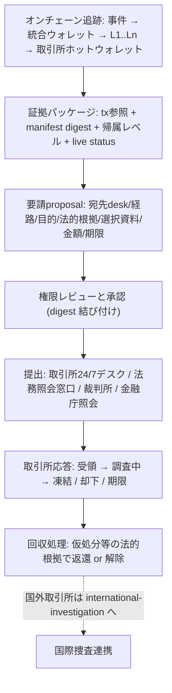

# 暗号資産取引所への凍結・返還要請: 共通設計契約 0.1.0

2026-10-09 JST、Jun依頼。Registryが[非実行の設計契約](../../solutions/exchange-asset-recovery.json)を管理し、Mithril Fundはcommit/hashを固定したsnapshotで参照する。オンチェーン追跡結果 (kill-chain レポート) から、取引所 (CEX) の stolen-funds デスク・法務照会窓口・裁判所への停止要請までを接続する設計。実際の要請提出、取引所の凍結判断、回収・還付は planned のままで、この契約はそれらを実行するものではない。

## 全体動線

矢印は設計であり、自動提出機能ではない。追跡の確定を要請の受理、提出を凍結、凍結を回収としない。

## 担当者とデータの所有

案件リード、オンチェーン解析者、法務レビュー者、取引所窓口、当局窓口、取引所応答者を指名する。役割・職務・委任・有効期限・失効を確認した記録が必要。ログイン・API scope・署名鍵の所持を権限の証明としない。

原資料 (tx 生データ、TronGrid/Tronscan の snapshot、トラッカーのページ) と国内案件番号は各機関の管理下に残す。証拠パッケージは原本を書き換えず、別ID/版の派生物として原資料の参照と秘匿化範囲を記録する。秘密鍵や私的アドレスを包摂した「全件 export」を既定にしない。

## 証拠パッケージの帰属レベル

- **on-chain provenance**: tx hash・block height・API snapshot hash・取得時刻・クエリ窓に固定した観測。追跡窓外の outflow は未観測であり、退場していない証明ではない。
- **third-party tracker label**: USDTBanList 等のトラッカーによる「Binance (CEX)」等の帰属。on-chain proof ではなく、高信頼外部証拠として扱い、提出時は出典 URL と snapshot を添付する。
- **exchange confirmation**: 取引所が着信・保有を確認した段階。凍結判断は取引所の判断であり、国内当局の決定ではない。
- **court order return**: 裁判所の差し押さえ・仮処分による返還。回収処理はこれにのみ確定させる。

ライブ状態は取得時点のウォレット活動 (例: 本日 01:03 JST 未放出出金) とし、提出前に再確認する。ホットウォレットは常時出金処理を行うため、live status は stale になり得る。

## 要請 proposal と承認

- proposal は案件、取引所、desk/窓口、経路、目的、法的根拠への参照、権限、選択した資料パッケージ、manifest digest、情報区分、要請アクション (照会/凍結/返還)、金額、ウォレット参照、期限、作成者・作成時刻を指定する。これは設計 field 名であり、現在の API が受理する schema ではない。
- approval は proposal digest に結び付け、宛先 desk・目的・資料版・情報区分・ウォレット参照・経路・法的根拠を変えたら、またオンチェーン状態が実質的変化 (例: 対象資金が他チェーンへ退場) したら再承認する。
- 部分金額 (全額の一部のみの凍結要請) は許可する。

## 提出、失敗、停止

- 提出 (submission) は取引所の受領 (acknowledged) ではない。取引所 ticket 参照と channel receipt を記録し、両者が整合するまで retry しない。
- 凍結 (frozen) は回収 (recovery) ではない。解除条件・金額・対象ウォレットを応答として記録する。
- 国外取引所は `international-investigation` の国際捜査連携経路 (MLAT・NCB) へ接続し、この契約の domestic 経路で国外提出をしない。
- 期限切れ・却下・失効・unknown は別々の状態として保存し、結果不明を「安全」または「提出済み」に畳み込まない。失効時の取引所への通知記録を保持し、提出済み資料の recall を主張しない。

## 提供しないもの

取引所 API 提出、自動凍結実行、取引所によるオンチェーン帰属、法的凍結判断、国外 MLAT 提出、回収支払決済、汎用 CEX ディレクトリ、ライブ CEX 残高監視サービスは提供しない。これらは本契約の範囲外であり、将来の別モジュールとして評価する。
