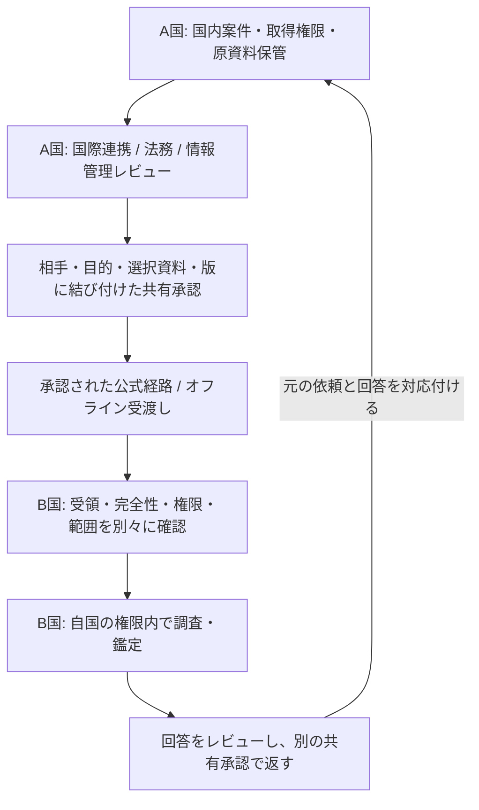

# 国際捜査連携: 共通設計契約 0.1.0

2026-10-08 JST、Jun依頼。Registryが [非実行の設計契約](../../solutions/international-investigation.json) を管理し、Mithril Fundはcommit/hashを固定したsnapshotで参照する。機関別solution、ローカル評価kit、API/MCP、Web/Desktop/nativeの境界を接続する設計。実際の国際連携、機関本人認証、公式経路接続、案件の遠隔共有はplannedのまま。

## 全体動線

この矢印は設計であり、自動転送機能ではない。国内の6段階（依頼・承認・調査・報告受領・修正・再検証）を維持し、国際照会は調査/報告の途中に入る別の往復処理とする。相手国は自国の権限を確認する。元の調査承認だけで相手国の調査や外部送信を許可しない。

## 担当者とデータの所有

国内案件リード、国際連携窓口、権限レビュー者、情報管理/保管担当、鑑定担当、独立レビュー者、相手国窓口、相手国案件リードを指名する。機関・職務・委任・有効期限・失効を確認した記録が必要。ログイン・プロフィール・API scope・署名鍵の所持を機関権限の証明としない。

原資料と国内案件番号は各機関の管理下に残す。共同の `collaborationId` は国内案件との対応を管理する識別子であり、全原資料を集める共通DBを作る理由にしない。対応表自体も捜査情報なので、相手に国内案件番号を開示できない場合は許可された別名参照を使う。捜査側、検察、弁護/当事者側、裁判官の閲覧と記録/IT担当のアクセスを別の権限にする。

## 共有承認と資料パッケージ

共有proposalに送信/受信機関、目的、法的根拠への参照、権限、選択した資料、manifest digest、情報区分、origin/destination、承認済み保存場所、保持・再共有条件、期限、経路を指定する。これは設計field名であり、現在のForensics HTTP APIが受理するschemaではない。approvalはproposal digestに結び付け、宛先・目的・資料版・情報区分・保存場所・経路を変えたら再承認する。

既存ローカル評価kitの署名manifest・custody・checkpoint・報告草稿/レビューを資料の基礎に使う。相手への開示用資料は原本を書き換えず、別ID/版の派生物として、原資料の参照と秘匿化範囲を記録する。相手に渡せない原資料がある場合、その欠落と独立再検証の限界を明示する。秘密鍵と非公開原本を包摂した「全件export」を既定にしない。

署名検証のtrust/keyは機関が承認した独立経路で交換・確認する。パッケージ内の鍵を自動で信頼しない。既存署名形式 `python-json-sort-ascii-v1` を普遍的な標準形式と呼ばない。相手機関での暗号/形式互換性、鍵失効・長期検証は追加評価する。hash・署名・受渡し台帳は原資料の完全性確認を助けるが、取得の適法性・供述の真実性・証拠採否を保証しない。

## 受領、失敗、停止

送信、受領、完全性確認、相手側権限確認、調査着手、回答レビュー、回答、終了を別の状態にする。API成功や外部経路のdispatchを相手の受領とみなさない。不明な結果は `unknown` / `receipt-pending` のままoperation IDと公式受領記録で照合し、重複照会・再送を自動実行しない。宛先違い・改変・失効・未承認は拒否/停止し、部分資料と未取得を隠さない。

失効時は以後の閲覧・配信を止め、相手機関への通知と適用される保持/削除判断を記録する。既に外部へ渡ったbytesを遠隔消去できると主張しない。機関の保存義務やholdを自動で解除しない。受領国が別国へ再共有する場合も、独立した権限・条件・承認を確認する。

## 多言語・分析・司法判断

原文、翻訳、正規化観測、分析者の推論、法的評価、AI草稿を分ける。翻訳はsource digest、原/対象言語、方法、担当、版、レビューと不明箇所を記録し、重要な固有名詞・日時・否定・条件を人が確認する。UTCと元の時刻/zone/精度を併記し、時計差と不明値を維持する。IP・似た名前・翻訳語の一致だけで人物/組織を同定しない。

機関間で共有した技術結果と、検察の立証、弁護士の反証、裁判官の証拠採否/評価/判断は別。報告訂正、鑑定の再検査、システム修正、司法手続上の対応も別操作とする。

## 国際協力経路の扱い

各国のcompetent authorityが案件ごとに経路と条件を選ぶ。INTERPOLのNCB/I-24/7、権限ある地域経路、適用される電子証拠窓口や司法共助は経路の例であり、どの国・案件でも同じ経路を使えるという意味ではない。緊急保全・警察情報交換・正式な証拠取得/提出を別目的とする。条約参加、適用法、受領資格、移転・配備条件、機関の運用合意を確認し、不明なら転送を止める。一般利用者が直接全世界の捜査機関へ案件を送る動線を設けない。

## Registryと製品の分担

| 層 | 設計責任 / 現在との接続 |
| --- | --- |
| Registry | この契約、既存機関solutionとの関連、qualification、資料形式とローカル評価部品。非実行契約をindexのinstallable MCP/Toolとして登録しない |
| Forensic kit / ローカルstdio MCP | 原資料をローカルに残すpack、署名/独立verify、custody、報告レビュー。国際dispatchや相手機関のログインは含まない |
| Fund API / HTTP MCP | 現行のaccount-owned report importとは別に、将来の機関認証・案件grant・proposal/approval/receipt・監査を設計する。既存tokenを黙って昇格させない |
| App / Web / Desktop | 依頼・共有前レビュー・受領・資料比較・回答を役割別に表示する案。Desktopローカル権限をWebに引き継がない |
| Console | 機関管理者のmembership/権限/連携管理案。法的承認や公式機関認証の代替ではない |
| iOS / Android | 現在はchat/balance/device grant。将来は機関が許可した通知/読取から評価し、証拠や承認能力を通知本文へ含めない |
| Knowledge / Analysis / Graph / Kyber | 公開知識・方法・関係探索・窓口/手続説明。公的データの案内と機関間データ交換を分離する |

## 受入条件と導入順

1. 2つの架空機関・別trust・合成資料でオフライン受渡しを評価。原本を維持し、受領記録、宛先違い/改変拒否、翻訳対応、資料の限界を確認する。
2. 機関/案件/資料単位の権限とproposalの版を検証。宛先・目的・manifest・保存先変更、期限・失効・再共有をテストする。国内案件リンクの情報漏えいと弁護側等の隔離も確認する。
3. 不明な送信結果、二重操作、停止、相手側拒否/部分結果、受領後の失効を評価し、公式受領記録とMithril内部記録の照合手順を作る。
4. 権限者が法域・正式経路・配備/保持条件と運用責任を確定し、限定された実機関評価へ進む。全世界の対応や正式channel connectorを一括で提供済みとしない。

この統合で新しい収集/共有ツール、credential、秘密鍵、機関IDP、ネットワーク接続、store/native releaseは有効化しない。

## 参照

- [既存機関portfolio](agency-target-portfolios.md)、[ローカル評価kit](agency-evaluation.md)、[署名とローカル実行契約](../../skills/security/mithril-forensic-evidence/references/contract.md)
- [INTERPOL NCB](https://www.interpol.int/en/Who-we-are/Member-countries/National-Central-Bureaus-NCBs): 2026-10-08公式本文確認。NCB経由のI-24/7接点と一般から国内警察への入口。
- [欧州評議会24/7 Network](https://www.coe.int/en/web/cybercrime/24/7-network-new): 2026-10-08公式本文確認。電子証拠・迅速協力とMLAの接点。個別国/案件の条件は別確認。
- [Europol SIENA](https://www.europol.europa.eu/how-we-work/services-support/siena): 2026-10-08公式検索結果確認。本文はJS shellのみ。Mithrilからの接続権限・protocolは未確認。
- Mithril Fund統合側の `docs/design/international-investigation-integration.md` と固定snapshotを併せてレビューする。
